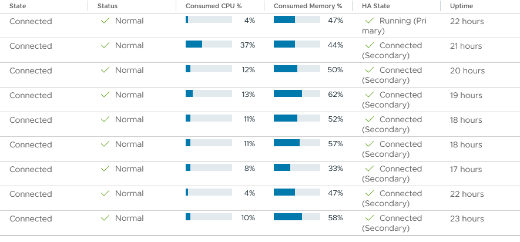

# DRS-Simulator

## Constraint-aware VM placement & evacuation engine for VMware vSphere

DRS-Simulator is a PowerShell-based custom scheduling and orchestration
engine for VMware vSphere.

The project continuously evaluates cluster resource usage, VM placement
constraints, host availability and migration safety to make controlled
vMotion decisions.

> Keep the infrastructure balanced while preserving placement constraints —
> and prioritize host evacuation when maintenance requires it.

---

## Running on real vSphere clusters

DRS-Simulator is currently running against **two production vSphere clusters**, continuously evaluating resource usage, placement constraints
and host availability.

The scheduler has been operating continuously through host reboots and
maintenance operations, progressively redistributing workloads without
requiring manual rebalancing.

### Overnight result

After more than 20 hours of continuous operation:



**Observed cluster state:**

| Metric | Observed |
|---|---:|
| Hosts | 9 |
| CPU utilization | 4–37% |
| Typical CPU range | 4–13% |
| Memory utilization | 33–62% |
| Automated balancing | Active |
| Manual rebalancing | None |

The scheduler progressively converges toward a stable resource distribution
while avoiding unnecessary migration activity.

---

## Why DRS-Simulator?

VMware vSphere already provides Distributed Resource Scheduler (DRS).

The goal of this project is **not to replace VMware DRS**, but to explore
what a custom scheduling engine can provide when the decision process needs
to be explicit, configurable, observable and operationally controlled.

---

# VMware DRS vs DRS-Simulator

DRS-Simulator is **not intended to replace VMware DRS**.

The project explores a different design philosophy: a transparent and explicitly configurable scheduling engine where the decision process, migration limits and operational policies can be directly controlled.

| Capability                    |     VMware DRS     |      DRS-Simulator     |
| ----------------------------- | :----------------: | :--------------------: |
| Resource balancing            |          ✅         |            ✅           |
| VM-to-Host rules              |          ✅         |            ✅           |
| Affinity rules                |          ✅         |            ✅           |
| Anti-affinity rules           |          ✅         |            ✅           |
| Custom resource weighting     |  VMware-controlled |    **Configurable**    |
| Delta-based balancing         |  VMware-controlled |      **Explicit**      |
| VM blacklist by name          |     Not native     |          **✅**         |
| VM blacklist by tag           |     Not native     |          **✅**         |
| Dry-run scheduling            | Different workflow |          **✅**         |
| Explicit migration throttling |  VMware-controlled |    **Configurable**    |
| Persistent evacuation queue   |   VMware-managed   |      **Explicit**      |
| Storage pre-flight validation |   vSphere-managed  |      **Explicit**      |
| Built-in RFC 3164 Syslog      |          ❌         |          **✅**         |
| Custom evacuation fallback    |   VMware behavior  | **Best-effort policy** |

The purpose is not to claim that a custom script is universally better than VMware DRS.

The purpose is to provide a **controlled engineering platform for experimenting with scheduling policies and infrastructure automation**.
---

## Key capabilities

| Capability                      | Description                                                                                    |
| ------------------------------- | ---------------------------------------------------------------------------------------------- |
| **Constraint-aware placement**  | VM-to-host, affinity and anti-affinity rules                                                   |
| **Intelligent host evacuation** | Automatic VM evacuation when a host enters maintenance                                         |
| **Best-effort rule handling**   | Placement constraints are prioritized while allowing evacuation to complete when necessary     |
| **Multi-resource balancing**    | CPU, memory and optional network metrics                                                       |
| **Memory-centric scoring**      | Configurable weighted Load Score with memory as the dominant resource                          |
| **Delta-based balancing**       | Decisions based on deviation from the cluster average rather than fixed utilization thresholds |
| **VM blacklisting**             | Exclude VMs by name pattern or vCenter tag                                                     |
| **Migration throttling**        | Explicit limits on concurrent balancing and evacuation migrations                              |
| **Storage validation**          | Destination datastore accessibility is checked before vMotion                                  |
| **Persistent evacuation queue** | Evacuation state is maintained across processing loops                                         |
| **Dry-run mode**                | Evaluate scheduling decisions without performing migrations                                    |
| **Centralized logging**         | RFC 3164 Syslog integration                                                                    |
| **Long-running reliability**    | Caching, automatic reconnection, session recycling and memory monitoring                       |

---

# Architecture

At a high level, the scheduler follows this decision pipeline:

```text
                         vCenter
                            │
                            ▼
                  ┌───────────────────┐
                  │   Cluster State   │
                  └─────────┬─────────┘
                            │
              ┌─────────────┼─────────────┐
              ▼             ▼             ▼
          VM state       Host load      Rules
              │             │             │
              └─────────────┼─────────────┘
                            ▼
                   ┌─────────────────┐
                   │ Decision Engine │
                   └────────┬────────┘
                            │
              ┌─────────────┼─────────────┐
              ▼             ▼             ▼
          Placement      Evacuation    Balancing
              │             │             │
              └─────────────┼─────────────┘
                            ▼
                         vMotion
                            │
                            ▼
                     Syslog / Console
```

The engine continuously evaluates the cluster and selects migration targets according to the current operating context.

---

# Placement engine

## VM-to-Host rules

Specific VMs can be pinned to designated ESXi hosts.

Example:

```text
vm-license-server esxi-host-01.example.com
vm-backup-proxy esxi-host-04.example.com
```

This provides explicit VM-to-host placement constraints.

The simulator treats these rules as the highest-priority placement constraint during host evacuation.

---

## Affinity rules

VMs listed on the same line are intended to run together on the same ESXi host.

Example:

```text
vm-web-01 vm-web-02 vm-web-03
vm-db-01 vm-db-02
```

This allows application components that benefit from co-location to be considered as a placement group.

---

## Anti-affinity rules

VMs listed on the same line are intended to run on separate ESXi hosts.

Example:

```text
vm-dc-01 vm-dc-02
vm-k8s-node01 vm-k8s-node02
```

This is useful for improving availability and avoiding single-host failure domains.

During normal balancing, anti-affinity is respected.

During host evacuation, it is treated as a **best-effort constraint** so that maintenance operations can progress when no fully compliant target is available.

---

# Host evacuation

Host evacuation is one of the core design goals of DRS-Simulator.

When a host enters maintenance mode, the scheduler creates an evacuation workflow rather than treating the host like a normal balancing source.

The engine:

1. Detects hosts entering maintenance mode.
2. Builds or updates a persistent evacuation queue.
3. Identifies VMs that need to leave the host.
4. Determines eligible destination hosts.
5. Applies placement constraints according to priority.
6. Validates storage compatibility.
7. Checks current vMotion activity.
8. Limits the number of concurrent migrations.
9. Executes migrations progressively.
10. Continues processing until the host is fully evacuated.

This allows evacuation to proceed progressively rather than launching an uncontrolled burst of vMotions.

### Evacuation priority

Destination selection follows this hierarchy:

```text
1. VM-to-Host rules
       ↓
2. Affinity rules
       ↓
3. Anti-Affinity rules
       ↓
4. Best available host
```

The final fallback uses the lowest calculated **Load Score** among eligible hosts.

The objective is to preserve placement policies whenever possible while ensuring that an ESXi host can ultimately leave production when required.

---

# Custom load balancing

The simulator does not rely on a single CPU utilization threshold.

Instead, each host receives a composite **Load Score**.

## Load Score

The default formula is:

$$
\text{Load Score} =
(0.25 \times \text{CPU}\%)
+
(0.65 \times \text{Memory}\%)
+
(0.10 \times \text{Normalized Network}\%)
$$

Memory is intentionally given the highest weight because it is considered the primary resource bottleneck for the target high-density virtualization environment.

The network component is optional.

### Why weighted scoring?

A host with low CPU utilization is not necessarily a good migration target.

For example:

```text
Host A     CPU 8%     Memory 30%
Host B     CPU 5%     Memory 65%
```

A CPU-only scheduler would tend to favor Host B.

The weighted score instead recognizes that Host A has significantly more available memory capacity.

This allows placement decisions to consider the **overall resource profile** of the destination host.

---

# Delta-based balancing

The simulator uses a dynamic delta-based trigger instead of relying exclusively on absolute thresholds.

Default values:

```powershell
$DeltaTriggerCpu = 15
$DeltaTriggerMem = 15
```

A host is considered a potential migration source or target when its utilization deviates sufficiently from the cluster average.

Conceptually:

```text
                  Cluster average
                        │
        ┌───────────────┼───────────────┐
        │               │               │
     -15%              0%             +15%
        │                               │
        ▼                               ▼
   Potential                         Potential
    target                            source
```

This approach is intended to reduce unnecessary migrations when the cluster is already reasonably balanced.

It also allows the scheduler to progressively converge toward a stable state rather than continuously attempting to normalize every small difference.

---

# Operational safety controls

## VM blacklist

Certain VMs can be excluded from automated migration logic.

### By name pattern

```powershell
-NameBlacklistPatterns @("vCLS", "NOMOVE")
```

This allows naming conventions to act as operational protection mechanisms.

For example:

```text
NOMOVE-*
```

can be used to explicitly exclude exceptional workloads.

### By vCenter tag

```powershell
-TagBlacklistNames @("No-DRS")
```

This provides a cleaner classification-based approach when VM naming conventions should remain independent from operational policies.

Blacklisted VMs are ignored by the automated placement and migration logic.

---

# Storage compatibility

Before executing a vMotion, DRS-Simulator validates that the destination host can access the storage required by the VM.

This provides an explicit pre-flight validation step:

```text
VM
 │
 ├── Placement constraints
 │
 ├── Destination host capacity
 │
 └── Shared datastore accessibility
             │
             ▼
          vMotion
```

The goal is to detect an incompatible destination before submitting the migration task to vCenter.

---

# Migration throttling

Automated scheduling must avoid creating excessive vMotion activity.

DRS-Simulator therefore applies explicit migration limits.

```powershell
$MaxMigrationsBalancePerLoop = 3
$MaxMigrationsEvacTotal = 8
```

The evacuation engine also checks the number of currently active vMotion operations before launching additional migrations.

This provides predictable control over migration concurrency and reduces the risk of generating excessive storage, network or vCenter activity during large evacuation operations.

---

# Persistent evacuation queue

Host evacuation is managed through a persistent queue.

The queue tracks:

* VMs remaining to evacuate;
* powered-on and powered-off VMs;
* evacuation progress;
* affected host;
* migration state;
* current vMotion activity.

This means evacuation is processed over multiple scheduler loops instead of being treated as a single blocking operation.

The result is a controlled, progressive evacuation workflow.

---

# Caching and performance

DRS-Simulator is designed to run continuously.

Several levels of caching reduce unnecessary vCenter API calls.

## Cluster data cache

Cluster VM and host information is cached and refreshed periodically.

Configured refresh:

```text
30 seconds
```

This reduced observed vCenter API usage by approximately **50–60%** during development testing.

## Host load cache

CPU, memory and network metrics are also cached with a configurable TTL.

A `-BypassCache` option allows real-time data retrieval when required.

## Rule cache

Placement rules are parsed once and retained in memory.

The scheduler monitors the rule files using `LastWriteTime` and reloads them only when changes are detected.

This reduced rule-file I/O by approximately **93%** compared with continuously reparsing the files.

---

# Long-running reliability

The simulator is intended to run as a persistent automation process rather than as a one-shot migration script.

Reliability mechanisms include:

* automatic garbage collection;
* memory usage monitoring;
* automatic warnings when memory consumption exceeds the configured threshold;
* periodic vCenter session recycling;
* automatic reconnection;
* UDP socket cleanup for Syslog;
* statistics cache cleanup;
* persistent evacuation state.

Current operational intervals include:

```text
Garbage collection:       1 hour
vCenter session recycle:  2 hours
```

---

# Logging and observability

DRS-Simulator provides both local console logging and optional centralized Syslog output.

Syslog uses **RFC 3164 over UDP**.

```powershell
$SyslogServer = "syslog.example.com"
$SyslogPort = 514
$EnableSyslog = $true
```

Logged information includes:

* migration decisions;
* vMotion execution;
* rule violations;
* maintenance mode detection;
* host evacuation progress;
* balancing decisions;
* resource imbalance warnings;
* errors and troubleshooting information.

## Log levels

| Level           | Meaning                                                                   |
| --------------- | ------------------------------------------------------------------------- |
| **Error (3)**   | Critical script or migration failures                                     |
| **Warning (4)** | Resource issues, temporary constraint degradation or operational warnings |
| **Info (6)**    | Normal operational activity                                               |
| **Debug (7)**   | Detailed troubleshooting and performance information                      |

---

# Dry-Run mode

The scheduler can be executed without performing real VM migrations.

```powershell
.\DRS_simulator.ps1 -DryRun
```

This allows the decision engine to be validated against a real cluster while keeping vMotion operations disabled.

Dry-run mode is particularly useful when:

* introducing the scheduler into a new environment;
* validating placement rules;
* testing balancing thresholds;
* investigating unexpected migration decisions;
* preparing production configuration changes.

---

# Real-world lab validation

The scheduler has been tested continuously against a **9-host vSphere cluster**.

During extended testing, hosts were repeatedly rebooted and workloads were progressively redistributed by the scheduler.

The observed behavior was a progressive convergence toward a stable resource distribution rather than repeated large-scale rebalancing operations.

Example cluster state after overnight operation:

```text
Hosts:                  9
CPU utilization:        5–44%
Typical CPU range:      5–11%
Memory utilization:     33–62%
```

The cluster continued to rebalance progressively as workload distribution changed.

The objective is not to make every ESXi host numerically identical, but to maintain a stable overall resource distribution while respecting placement constraints and avoiding unnecessary vMotions.

---

# Configuration

## Basic parameters

```powershell
$VCenter = "vcenter.example.com"
$ClusterName = "production_cluster"
```

## Scheduler timing

```powershell
$NormalLoopSleepSeconds = 60
$EvacLoopSleepSeconds = 20
$RulesCheckEveryXLoops = 23
```

## Migration limits

```powershell
$MaxMigrationsBalancePerLoop = 3
$MaxMigrationsEvacTotal = 8
```

## Balancing triggers

```powershell
$DeltaTriggerCpu = 15
$DeltaTriggerMem = 15
```

## Syslog

```powershell
$SyslogServer = "syslog.example.com"
$SyslogPort = 514
$EnableSyslog = $true
```

---

# Usage

## Standard production mode

```powershell
.\DRS_simulator.ps1 `
    -VCenter "vcenter.example.com" `
    -ClusterName "production_cluster"
```

## Dry-run mode

```powershell
.\DRS_simulator.ps1 -DryRun
```

## Include network metrics

```powershell
.\DRS_simulator.ps1 -IncludeNetwork
```

## Disable Syslog

```powershell
.\DRS_simulator.ps1 -EnableSyslog:$false
```

---

# Rule files

The simulator uses three flat text configuration files.

## Affinity

`liste_affinite.txt`

VMs listed on the same line are grouped together.

```text
vm-web-01 vm-web-02 vm-web-03
vm-db-01 vm-db-02
```

## Anti-affinity

`liste_antiaffinite.txt`

VMs listed on the same line are distributed across different hosts.

```text
vm-dc-01 vm-dc-02
vm-k8s-node01 vm-k8s-node02
```

## VM-to-Host

`list_vm_to_host.txt`

Format:

```text
VM_Name Host_Name
```

Example:

```text
vm-license-server esxi-host-01.example.com
vm-backup-proxy esxi-host-04.example.com
```

---

# Installation

## Requirements

* PowerShell 5.1 or later
* VMware PowerCLI
* VMware vCenter Server 6.5 or later
* Appropriate vCenter permissions for VM migration and host management

## Clone the repository

```bash
git clone https://github.com/denisfoulon/DRS-Simulator.git
```

## Install VMware PowerCLI

```powershell
Install-Module -Name VMware.PowerCLI -Scope CurrentUser
```

## Create the vCenter credential file

```powershell
Get-Credential |
    Export-Clixml -Path "C:\Scripts\DRS\vcenter_credentials.xml"
```

---

# Version history

## v1.39 — 2026-06-29

### Rules check throttling adjustment

Increased the default rules check interval:

```powershell
$RulesCheckEveryXLoops = 23
```

The objective is to further minimize file I/O and CPU overhead in stable environments.

This release also establishes the project baseline for the 2026 release.

---

## v1.38

### Multi-core CPU calculation fix

Fixed a critical issue in `Get-HostLoad`.

Previously, `OverallCpuUsage` could be divided only by `CpuMhz`, resulting in incorrect CPU utilization values reaching **300–700% on multi-core hosts**.

The calculation now correctly accounts for the number of CPU cores:

```text
CpuMhz × NumCpuCores
```

This corrected silent failures in threshold comparisons and delta-based balancing.

---

## v1.37

### Delta-based balancing

Replaced fixed balancing thresholds with dynamic cluster-average deltas.

Default:

```powershell
$DeltaTriggerCpu = 15
$DeltaTriggerMem = 15
```

Hosts are now considered for migration when their utilization deviates significantly from the cluster average.

### Memory-weighted Load Score

Updated the scheduling algorithm to make memory the primary resource factor.

---

## v1.35 — 2026-02-16

### Cluster data caching

Introduced caching of cluster VMs and hosts with a 30-second refresh interval.

Observed vCenter API usage reduction:

**~50–60%**

### Host load cache

CPU, memory and network metrics are cached for 30 seconds.

Added:

```text
-BypassCache
```

for real-time measurements.

### Evacuation queue

Introduced a persistent evacuation queue with:

* remaining VM tracking;
* powered-off VM handling;
* live vMotion safety checks.

### Intelligent evacuation targeting

Introduced priority-based destination selection:

```text
VM-to-Host
    ↓
Affinity
    ↓
Anti-Affinity
    ↓
Best Host
```

Storage compatibility is validated before migration.

### Stability and memory optimization

Optimized:

* garbage collection;
* vCenter session recycling;
* memory monitoring.

---

## v1.34 — 2026-01-16

### Rules check throttling

Introduced:

```powershell
$RulesCheckEveryXLoops
```

Rules are cached in memory and reloaded only when the source files change.

Smart `LastWriteTime` monitoring reduced unnecessary rule-file I/O by approximately **93%**.

---

## v1.33 — 2026-01-16

Enhanced migration handling for host evacuation.

---

## v1.32 — 2025-12-16

Improved long-running reliability:

* automated garbage collection;
* vCenter session recycling;
* automatic reconnection;
* UDP socket disposal;
* statistics cache cleanup.

---

## v1.31 — 2025-12-02

Added RFC 3164 Syslog support over UDP while preserving local console output.

---

# Design principles

DRS-Simulator is built around several principles:

### 1. Constraints before optimization

The scheduler first determines where a VM **can** run before deciding where it **should** run.

### 2. Maintenance operations have priority

A host that needs to leave production must eventually be evacuated.

Normal placement optimization must not prevent operational maintenance from completing.

### 3. Avoid unnecessary migrations

A stable cluster should not constantly rebalance itself.

Delta-based triggers, weighted scoring and migration throttling are designed to reduce migration noise.

### 4. Make decisions observable

Every important scheduling decision should be understandable through logs and operational state.

### 5. Treat automation as an infrastructure service

Caching, reconnection, memory monitoring, throttling and persistent state are considered part of the scheduler itself, not optional extras.

---

# What this project demonstrates

DRS-Simulator was developed as an infrastructure engineering project rather than as a simple PowerShell automation script.

It demonstrates practical experience with:

* VMware vSphere / vCenter;
* PowerCLI;
* vMotion orchestration;
* VM placement algorithms;
* resource balancing;
* infrastructure automation;
* availability and maintenance operations;
* constraint management;
* migration safety;
* API usage optimization;
* long-running PowerShell processes;
* centralized logging;
* operational observability;
* fault-tolerant automation design.

---

# Troubleshooting

## Cannot connect to vCenter

Check:

* credential XML path;
* credential permissions;
* vCenter FQDN;
* TCP/443 connectivity;
* PowerCLI installation.

---

## No migrations occurring

Check:

* whether the VM matches `$NameBlacklistPatterns`;
* whether the VM has a `$TagBlacklistNames` tag;
* destination storage compatibility;
* current vMotion activity;
* delta trigger thresholds;
* placement rules.

---

## Rules are not applied correctly

Check:

* rule file paths;
* VM names;
* host names;
* whitespace and hidden characters;
* rule file syntax;
* rule reload interval.

The scheduler caches rules and reloads them when the source file changes.

---

# Contributing

Contributions are welcome.

Please:

1. Fork the repository.
2. Create a dedicated feature branch.
3. Test changes thoroughly in a lab or non-production environment.
4. Document behavioral changes.
5. Submit a detailed Pull Request.

---

# License

This project is licensed under the **MIT License**.

See [`LICENSE`](LICENSE) for details.

---

# Disclaimer

⚠️ **This project is provided AS-IS without warranty of any kind.**

Automated VM placement and migration can have significant operational consequences.

Always test the scheduler in a staging or non-production environment before deploying it against production infrastructure.

The author assumes no liability for operational damage resulting from the use of this software.

---

# Support

For bugs, questions or feature requests, please open an issue in the GitHub repository:

https://github.com/denisfoulon/DRS-Simulator
